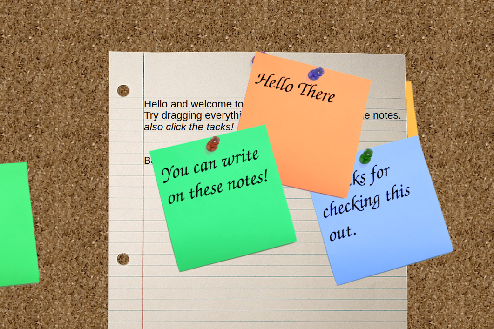

# Corkboard

This project was an experiment in making a physical looking website.
It consists of sticky notes that can be typed on dragged around and removed.
It allows more functionality that was not implemented, like adding traditional webpage aspects of navigation on paper and such.

# Building
To build, first install Sass as it's required for the build script.
Then install rollup through npm
```
npm install
```
Then run
```
make build
```
Your computer must have GNU make installed to build this, but it should be pretty simple to assemble it all by hand if you don't.

Once the build is complete, you will find the webpage files in the `target` directory.

